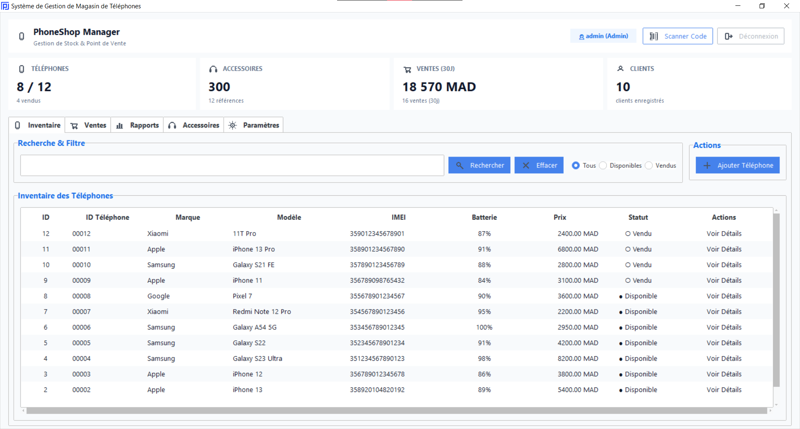
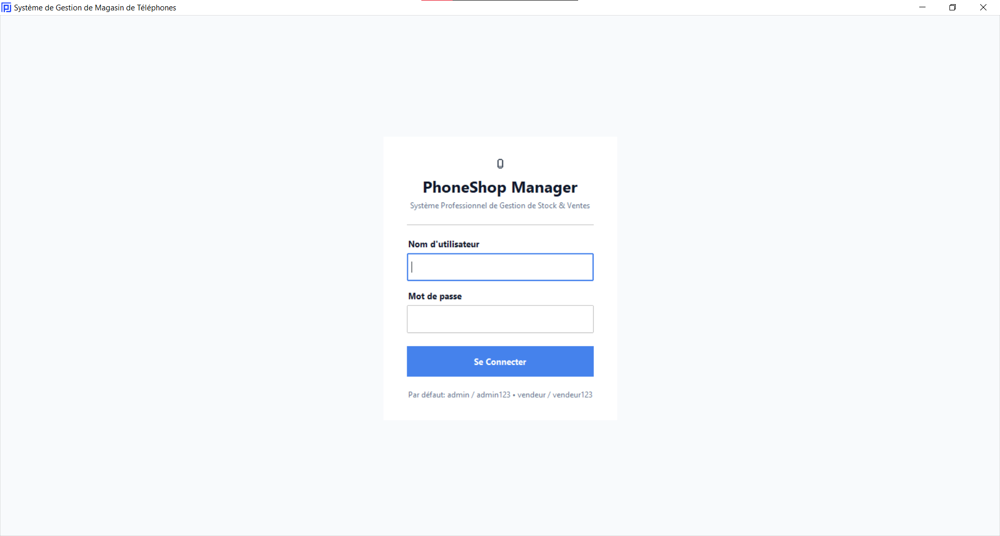
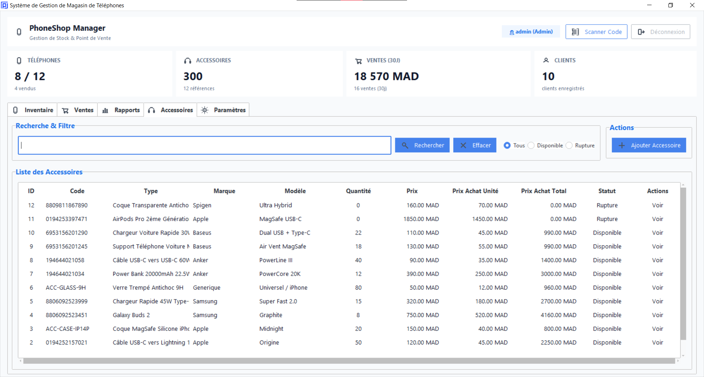
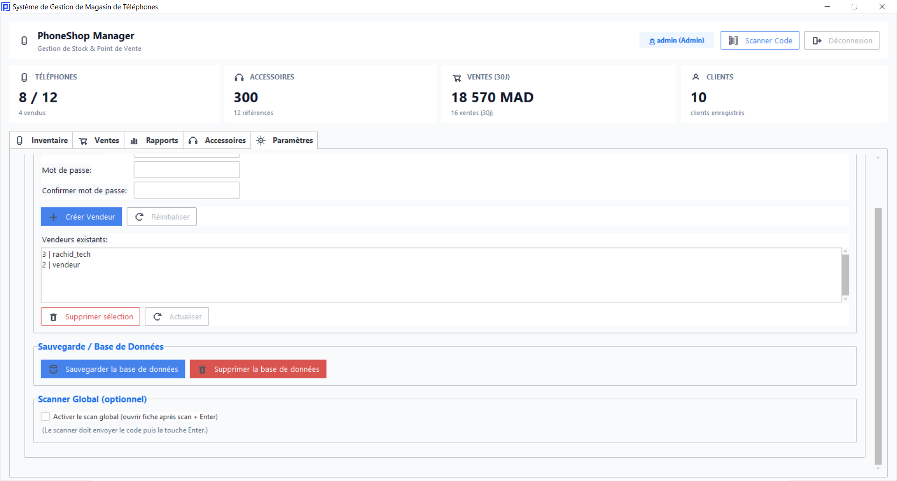

# 📱 Phone Store App (PhoneShopManager)

<p align="center">
  <b>Modern Desktop Management Software for Phone & Accessories Stores</b><br>
  <i>Logiciel moderne de gestion de stock et de point de vente pour magasins de téléphonie</i><br>
  <i>تطبيق مكتبي حديث لإدارة مبيعات ومخزون محلات الهواتف الذكية والإكسسوارات</i>
</p>

<p align="center">
  <a href="#english">🇬🇧 English</a> •
  <a href="#francais">🇫🇷 Français</a> •
  <a href="#arabic">🇸🇦 العربية</a>
</p>

<p align="center">
  
</p>

---

## 📸 Screenshots

| 🔐 **Connexion / Login** | 📱 **Inventaire / Inventory** |
| :---: | :---: |
|  |  |
| 🎧 **Accessoires & Codes-barres** | ⚙️ **Paramètres & Sauvegardes** |
|  |  |

---

<a id="english"></a>
## 🇬🇧 English

### Overview
**Phone Store App** is an all-in-one desktop application designed for phone retail shops and repair centers. It simplifies inventory management by tracking phones via IMEI numbers, managing accessory stock, issuing barcode labels, generating sales receipts, and exporting financial reports.

### ✨ Key Features
- 📱 **Phone Inventory**: Track phones by Brand, Model, IMEI, Battery Health (%), Condition, Purchase/Sale prices, and Status (*In stock* / *Sold*).
- 🎧 **Accessories & Barcodes**: Stock tracking with low-stock alerts, automatic barcode image generation, and quick barcode scanner support.
- 💰 **Point of Sale & Invoicing**: Fast checkout workflow, customer registration, and instant printable PDF invoices and receipts.
- 👥 **Role-Based Access**: Dedicated profiles for **Admin** (full management) and **Seller** (sales & inventory view).
- 📊 **Analytics & Reports**: Real-time KPI dashboard, sales history, and one-click export to **Excel** (`.xlsx` / `.csv`) and **PDF**.
- 💾 **Secure Database & Backups**: Built on SQLite with automatic migration and pre-migration backups stored in `%APPDATA%\PhoneShopManager`.

### 🚀 Getting Started

#### 1. Requirements
- Python 3.11 or newer

#### 2. Installation
```bash
# Clone the repository
git clone https://github.com/abdellah-agrm/phone-store-app.git
cd phone-store-app

# Create & activate a virtual environment (Windows)
python -m venv penv
penv\Scripts\activate

# Install dependencies
pip install -r requirements.txt
```

#### 3. Run the App
```bash
python main.py
```

**Default Credentials:**
- **Admin**: `admin` / `admin123`
- **Seller**: `vendeur` / `vendeur123`

#### 4. Test Data (Seeder CLI)
To quickly populate or clear demo data (phones, accessories, barcodes, buyers, sales):
```bash
python seeder.py
```

#### 5. Build Executable (.exe)
```bash
python build_exe.py
```
The standalone binary will be generated in `dist/main.exe`.

---

<a id="francais"></a>
## 🇫🇷 Français

### Présentation
**Phone Store App** est une application de bureau complète conçue pour les boutiques de vente et de réparation de téléphones. Elle centralise la gestion du stock de smartphones par numéro IMEI, le contrôle des accessoires, l'impression des codes-barres, l'édition des factures et l'analyse des ventes.

### ✨ Fonctionnalités clés
- 📱 **Gestion des Téléphones** : Suivi détaillé par marque, modèle, IMEI, état de la batterie (%), prix d'achat/vente et état (*Disponible* / *Vendu*).
- 🎧 **Accessoires & Codes-barres** : Gestion des quantités, alertes de réapprovisionnement, génération automatique et scan des étiquettes code-barres.
- 💰 **Vente & Facturation** : Caisse rapide, enregistrement des acheteurs, génération automatique de reçus et factures au format PDF.
- 👥 **Gestion des Utilisateurs** : Rôles séparés pour **Administrateur** (accès total) et **Vendeur** (ventes et consultation).
- 📊 **Tableau de Bord & Rapports** : Indicateurs KPI en temps réel, historique des ventes et export facile vers **Excel** (`.xlsx`, `.csv`) et **PDF**.
- 💾 **Base de Données & Sauvegardes** : Stockage sécurisé SQLite avec migrations automatiques et sauvegardes créées dans `%APPDATA%\PhoneShopManager`.

### 🚀 Démarrage rapide

#### 1. Prérequis
- Python 3.11 ou version supérieure

#### 2. Installation
```bash
# Cloner le projet
git clone https://github.com/abdellah-agrm/phone-store-app.git
cd phone-store-app

# Créer et activer l'environnement virtuel (Windows)
python -m venv penv
penv\Scripts\activate

# Installer les dépendances
pip install -r requirements.txt
```

#### 3. Lancement
```bash
python main.py
```

**Identifiants par défaut :**
- **Admin** : `admin` / `admin123`
- **Vendeur** : `vendeur` / `vendeur123`

#### 4. Données de test (Seeder)
Pour remplir ou réinitialiser la base de données avec des données d'exemple :
```bash
python seeder.py
```

#### 5. Générer le fichier .EXE
```bash
python build_exe.py
```
L'exécutable autonome sera généré dans `dist/main.exe`.

---

<a id="arabic"></a>
## 🇸🇦 العربية

<div dir="rtl">

### نظرة عامة
**Phone Store App (PhoneShopManager)** هو برنامج مكتبي متكامل لإدارة محلات بيع وصيانة الهواتف الذكية والإكسسوارات. يسهل البرنامج إدارة المخزون عبر تتبع الهواتف برقم الـ IMEI، ومتابعة مبيعات الإكسسوارات، وإنشاء ملصقات الباركود، وإصدار الفواتير، وتصدير التقارير المالية.

### ✨ المميزات الرئيسية
- 📱 **إدارة مخزون الهواتف**: تتبع الهواتف حسب الماركة، الموديل، رقم التسلسل (IMEI)، نسبة صحة البطارية، سعر الشراء والبيع، وحالة الهاتف (*متوفر* / *مباع*).
- 🎧 **الإكسسوارات والباركود**: متابعة الكميات المتبقية وتنبيهات نفاد المخزون، مع توليد وقراءة صور الباركود تلقائياً.
- 💰 **نقطة البيع وإصدار الفواتير**: تسجيل سريع لعمليات البيع، تسجيل بيانات المشترين، وطباعة الفواتير والإيصالات بصيغة PDF.
- 👥 **نظام الصلاحيات والمستخدمين**: حسابات مخصصة للمدير (**Admin**) مع صلاحيات كاملة، والبائع (**Vendeur**) للمبيعات والمشاهدة.
- 📊 **لوحة تحكم وتقارير فورية**: إحصائيات مالية مباشرة، وتصدير البيانات بضغطة زر إلى ملفات **Excel** (`.xlsx`, `.csv`) و **PDF**.
- 💾 **قاعدة بيانات آمنة ونسخ احتياطي**: قاعدة بيانات SQLite محلية مع تحديثات تلقائية للجداول ونسخ احتياطي في مسار `%APPDATA%\PhoneShopManager`.

### 🚀 طريقة التشغيل

#### 1. المتطلبات
- بايثون 3.11 أو أحدث (Python 3.11+)

#### 2. التثبيت
```bash
# استنساخ المشروع
git clone https://github.com/abdellah-agrm/phone-store-app.git
cd phone-store-app

# إنشاء وتفعيل البيئة الافتراضية (Windows)
python -m venv penv
penv\Scripts\activate

# تثبيت المكتبات المطلوبة
pip install -r requirements.txt
```

#### 3. تشغيل البرنامج
```bash
python main.py
```

**بيانات الدخول الافتراضية:**
- **المدير**: `admin` / `admin123`
- **البائع**: `vendeur` / `vendeur123`

#### 4. إدارة البيانات التجريبية (Seeder)
لإضافة أو مسح بيانات تجريبية (هواتف، إكسسوارات، زبائن، مبيعات):
```bash
python seeder.py
```

#### 5. تجميع البرنامج كملف تنفيذي (.EXE)
```bash
python build_exe.py
```
سيتم إنشاء الملف النهائي في المسار `dist/main.exe`.

</div>

---

## 📄 License
This project is licensed under the MIT License.
